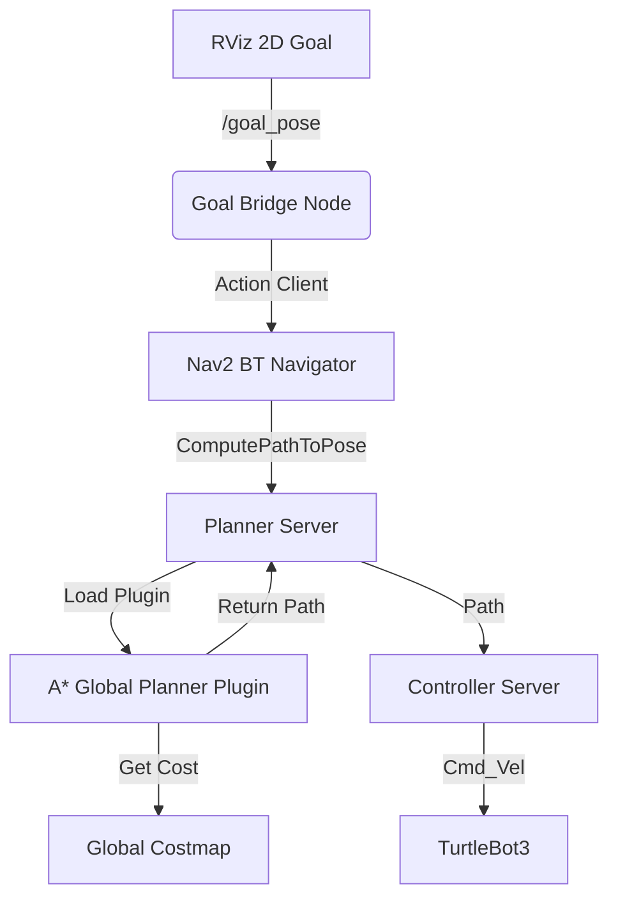

# TurtleBot3 A* Global Planner Plugin 🚀

A custom **A* (A-Star) Global Planner Plugin** implementation for the **ROS 2 Humble Navigation Stack (Nav2)**. This project demonstrates how to create a custom global planner plugin compliant with `nav2_core::GlobalPlanner` interface, integrated with `nav2_costmap_2d` and deployed via Docker.


---

## 📸 Overview

This plugin replaces the standard NavPlanner or SmacPlanner with a custom A* implementation. It allows the TurtleBot3 to plan optimal paths in a static map, considering inflation layers and obstacles.

### Architecture



---

## ✨ Features

- **Standard Nav2 Plugin**: Implements `nav2_core::GlobalPlanner` interface.
- **Costmap Integration**: Works directly with `nav2_costmap_2d` to handle obstacles and inflation layers safely.
- **Improved Goal Setting**: Includes a custom **Goal Bridge** node to make RViz's standard "2D Goal Pose" button compatible with Nav2.
- **Dockerized**: Fully containerized environment including Gazebo, RViz, and Nav2 stack.
- **A* Algorithm**:
  - Manhattan/Euclidean Heuristics
  - 8-connected grid search
  - Priority Queue optimization

---

## � Installation & Build

### Prerequisites
- Ubuntu 22.04 LTS
- ROS 2 Humble
- TurtleBot3 Packages (`ros-humble-turtlebot3*`)
- Nav2 Packages (`ros-humble-navigation2`, `ros-humble-nav2-bringup`)

### Build from Source

```bash
# Create workspace
mkdir -p ~/turtlebot3_ws/src
cd ~/turtlebot3_ws/src

# Clone repository
git clone https://github.com/whasancan/a-star-algorithm-turtlebot.git my_astar_planner

# Install dependencies
cd ~/turtlebot3_ws
rosdep install --from-paths src --ignore-src -r -y

# Build
colcon build --symlink-install
source install/setup.bash
```

---

## 🚀 Usage

### Option 1: Running Locally

1. **Launch Everything (Simulation + Nav2 + RViz):**
   ```bash
   export TURTLEBOT3_MODEL=burger
   ros2 launch my_astar_planner nav2_launch.py
   ```

2. **Set Initial Pose:**
   - In RViz, use the **"2D Pose Estimate"** button to set the robot's initial location on the map.

3. **Send a Goal:**
   - Use the standard **"2D Goal Pose"** button in RViz.
   - Click anywhere on the map. The robot will plan a path and move!

### Option 2: Running with Docker 🐳

Avoid cryptic dependencies and run the entire stack in a container.

1. **Build the Image:**
   ```bash
   cd src/my_astar_planner/docker
   docker-compose build
   ```

2. **Run the Container:**
   ```bash
   xhost +local:root  # Allow GUI display
   docker-compose up
   ```

   *Note: This launches Gazebo and RViz from within the Docker container.*

---

## 📁 Project Structure

```
my_astar_planner/
├── config/
│   ├── nav2_params.yaml      # Nav2 & Planner configuration
│   └── nav2_rviz.rviz        # RViz configuration
├── docker/
│   ├── Dockerfile            # Container definition
│   ├── docker-compose.yml    # Orchestration
│   └── entrypoint.sh         # Startup script
├── include/my_astar_planner/
│   └── astar_global_planner.hpp  # Plugin header
├── launch/
│   └── nav2_launch.py        # Main launch file
├── scripts/
│   ├── goal_bridge.py        # RViz to Nav2 bridge
│   └── send_goal.sh          # CLI helper
├── src/
│   └── astar_global_planner.cpp  # Plugin implementation
├── CMakeLists.txt
├── package.xml
└── plugin_description.xml    # Plugin export definition
```

---

## � Configuration

You can tune the planner parameters in `config/nav2_params.yaml`:

```yaml
planner_server:
  ros__parameters:
    planner_plugins: ["GridBased"]
    GridBased:
      plugin: "my_astar_planner/AStarGlobalPlanner"
      # Potential internal parameters could be added here
```

---

## 👤 Author

**Hasancan**
- GitHub: [@whasancan](https://github.com/whasancan)

---

## 📄 License

This project is licensed under the MIT License - see the LICENSE file for details.
