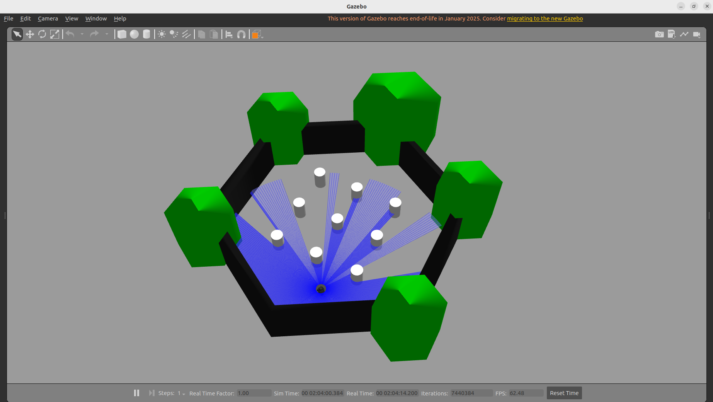
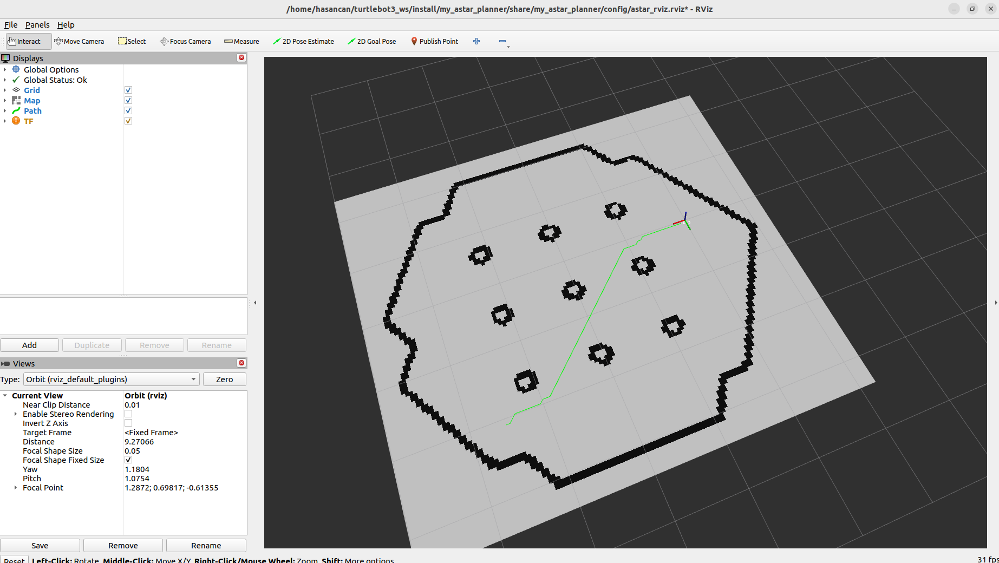

# TurtleBot3 A* Path Planner 🤖

ROS2 Humble üzerinde TurtleBot3 robotu için **C++ ile yazılmış** A* algoritması tabanlı path planning ve path following paketi.


---

## 📸 Demo

### Gazebo Simülasyonu
> TurtleBot3 robot, engelli dünyada path planning ile hedefe ilerliyor.



### RViz Path Visualization
> A* algoritması ile hesaplanan optimal yol (yeşil çizgi) ve harita görünümü.



### Sistem Çalışma Diyagramı

```
┌─────────────┐     /goal_pose      ┌─────────────┐     /astar_path     ┌─────────────┐
│    RViz     │ ──────────────────► │  A* Planner │ ──────────────────► │Path Follower│
│  (Hedef)    │                     │   (C++)     │                     │   (C++)     │
└─────────────┘                     └─────────────┘                     └──────┬──────┘
                                          ▲                                    │
                                          │ /map                               │ /cmd_vel
                                          │                                    ▼
                                    ┌─────────────┐                     ┌─────────────┐
                                    │ Map Server  │                     │  TurtleBot3 │
                                    └─────────────┘                     │  (Gazebo)   │
                                                                        └─────────────┘
```

---

## 🎯 Özellikler

- ✅ **A* Path Planning** - Optimal yol bulma algoritması
- ✅ **8 Yönlü Hareket** - Düz + çapraz hareket desteği
- ✅ **Euclidean Heuristic** - Doğru mesafe tahmini
- ✅ **Inflation Layer** - Robot yarıçapı kadar güvenlik mesafesi
- ✅ **Path Following** - Robotun fiziksel olarak yolu takip etmesi
- ✅ **RViz Entegrasyonu** - Görsel hedef belirleme
- ✅ **Tek Komutla Başlatma** - Launch file ile kolay kullanım

## 📦 Paket Yapısı

```
my_astar_planner/
├── src/
│   ├── astar_node.cpp        # A* algoritması ve path planning
│   └── path_follower.cpp     # Robot hareket kontrolü
├── launch/
│   └── astar_planner.launch.py
├── config/
│   └── astar_rviz.rviz
├── include/
│   └── my_astar_planner/
├── CMakeLists.txt
├── package.xml
└── README.md
```

## 🚀 Kurulum

### Gereksinimler
- Ubuntu 22.04
- ROS2 Humble
- TurtleBot3 paketleri
- Gazebo
- Nav2 Map Server

### Derleme

```bash
# Workspace oluştur (yoksa)
mkdir -p ~/turtlebot3_ws/src
cd ~/turtlebot3_ws/src

# Paketi klonla
git clone https://github.com/KULLANICI_ADIN/my_astar_planner.git

# Derle
cd ~/turtlebot3_ws
colcon build --packages-select my_astar_planner
source install/setup.bash
```

## 🎮 Kullanım

### Tek Komutla Çalıştırma

```bash
export TURTLEBOT3_MODEL=burger
source ~/turtlebot3_ws/install/setup.bash
ros2 launch my_astar_planner astar_planner.launch.py
```

Bu komut otomatik olarak başlatır:
1. **Gazebo** - TurtleBot3 simülasyonu
2. **Map Server** - Kayıtlı haritayı yükler
3. **A* Planner** - Path planning node
4. **RViz** - Görselleştirme

### Robot Hareketi İçin

Ayrı bir terminalde path follower'ı başlat:

```bash
source ~/turtlebot3_ws/install/setup.bash
ros2 run my_astar_planner path_follower
```

### Hedef Belirleme

1. RViz'de **"2D Goal Pose"** butonuna tıkla
2. Haritada hedef noktaya tıkla ve sürükleyerek yönü belirle
3. Yeşil path çizgisi görünecek ve robot hedefe gidecek

## 📡 ROS2 Topic'leri

| Topic | Mesaj Tipi | Açıklama |
|-------|------------|----------|
| `/map` | `nav_msgs/OccupancyGrid` | Harita verisi (subscribe) |
| `/odom` | `nav_msgs/Odometry` | Robot pozisyonu (subscribe) |
| `/goal_pose` | `geometry_msgs/PoseStamped` | RViz hedefi (subscribe) |
| `/astar_path` | `nav_msgs/Path` | Hesaplanan yol (publish) |
| `/cmd_vel` | `geometry_msgs/Twist` | Hareket komutu (publish) |

## ⚙️ A* Algoritması Detayları

### Temel Formül
```
f(n) = g(n) + h(n)
```
- **g(n)**: Başlangıçtan n'e kadar gerçek maliyet
- **h(n)**: n'den hedefe tahmini maliyet (Euclidean)
- **f(n)**: Toplam maliyet

### Önemli Parametreler

| Parametre | Değer | Açıklama |
|-----------|-------|----------|
| Hareket Yönleri | 8 | Düz (4) + Çapraz (4) |
| Çapraz Maliyet | 1.41 | √2 (Euclidean) |
| Engel Eşiği | 50 | occupancy > 50 = engel |
| Inflation Radius | 3 hücre | ~0.15m güvenlik mesafesi |

### Kod Yapısı

```cpp
// AStarNode - Her grid hücresi için düğüm
struct AStarNode {
    int x, y;           // Grid koordinatları
    double g_cost;      // Başlangıçtan maliyet
    double h_cost;      // Hedefe tahmini
    double f_cost;      // g + h
    std::shared_ptr<AStarNode> parent;  // Yol takibi için
};

// Priority Queue - En düşük f önce
std::priority_queue<..., CompareNode> open_list;
```

## 🗺️ Harita Oluşturma

Kendi haritanızı oluşturmak için:

```bash
# 1. SLAM başlat
export TURTLEBOT3_MODEL=burger
ros2 launch turtlebot3_cartographer cartographer.launch.py use_sim_time:=True

# 2. Robotu gezdirerek harita oluştur
ros2 run turtlebot3_teleop teleop_keyboard

# 3. Haritayı kaydet
ros2 run nav2_map_server map_saver_cli -f ~/turtlebot3_map
```

## 🔧 Manuel Başlatma

Ayrı terminallerde:

```bash
# Terminal 1: Gazebo
ros2 launch turtlebot3_gazebo turtlebot3_world.launch.py

# Terminal 2: Map Server + Lifecycle
ros2 run nav2_map_server map_server --ros-args -p yaml_filename:=$HOME/turtlebot3_map.yaml
ros2 lifecycle set /map_server configure && ros2 lifecycle set /map_server activate

# Terminal 3: A* Planner
ros2 run my_astar_planner astar_node

# Terminal 4: Path Follower
ros2 run my_astar_planner path_follower

# Terminal 5: RViz
rviz2
```

## 📊 Performans

- **Path hesaplama**: < 100ms (tipik harita boyutları için)
- **Kontrol döngüsü**: 20 Hz
- **Waypoint toleransı**: 0.12m

---

## 🧠 A* Algoritması Nasıl Çalışır?

### Adım Adım Açıklama

```
1. Başlangıç düğümünü open_list'e ekle
2. Open_list boş değilken:
   a. En düşük f değerli düğümü al
   b. Hedefe ulaştıysan → Yolu döndür
   c. 8 komşuyu kontrol et:
      - Geçerli mi? (harita içinde)
      - Engel mi? (inflation dahil)
      - Ziyaret edilmiş mi?
   d. Geçerli komşuları open_list'e ekle
3. Yol bulunamadı
```

### Görsel Açıklama

```
    ┌───┬───┬───┬───┬───┐
    │   │   │ ▓ │   │   │     ▓ = Engel
    ├───┼───┼───┼───┼───┤     S = Start (Başlangıç)
    │   │ S │ ▓ │   │ G │     G = Goal (Hedef)
    ├───┼───┼───┼───┼───┤     * = Bulunan yol
    │   │ * │ ▓ │ * │ * │
    ├───┼───┼───┼───┼───┤
    │   │ * │ * │ * │   │
    ├───┼───┼───┼───┼───┤
    │   │   │   │   │   │
    └───┴───┴───┴───┴───┘
```

### Neden A* Kullandım?

| Algoritma | Avantaj | Dezavantaj |
|-----------|---------|------------|
| **BFS** | Basit | En kısa yolu bulmaz (ağırlıklı) |
| **Dijkstra** | Optimal | Yavaş (her yöne bakar) |
| **A*** ✅ | Optimal + Hızlı | Heuristic gerekir |

---

## 🔮 Gelecek Geliştirmeler

- [ ] Dinamik engel tespiti (LiDAR ile)
- [ ] Path smoothing
- [ ] Farklı heuristic seçenekleri
- [ ] ROS2 parameter server entegrasyonu

## 📋 Bağımlılıklar

```xml
<depend>rclcpp</depend>
<depend>nav_msgs</depend>
<depend>geometry_msgs</depend>
<depend>tf2_ros</depend>
<depend>tf2_geometry_msgs</depend>
```

## 👤 Geliştirici

**Hasancan** - 2025

---

## 📄 Lisans

MIT License
